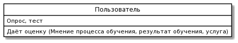
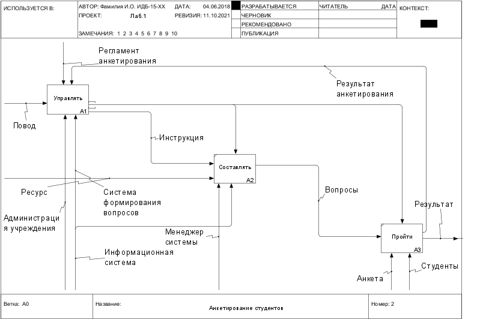
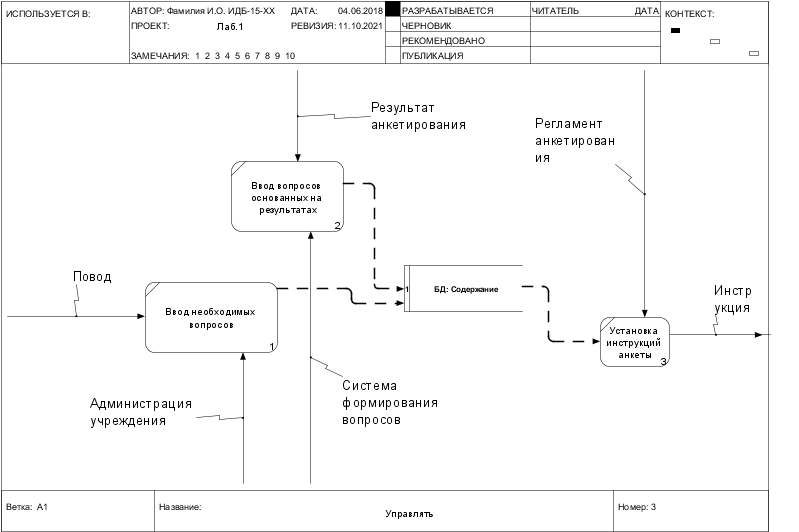

# Отчет о лабораторных работах
# Студент группы ИДБ-18-07 Заливалов А.Ю.
# Лабораторная :one:

###### Предложение: Даёт оценку

Предложение: Пользователь даёт оценку образовательной услуги с помощью теста и опроса

###### Диаграмма классов

###### Диаграмма прецедентов

# Лабораторная :two:

## IDEF0 diagram
###### Контекстная:

## На диаграмме изображен процесс создания анкеты-опроса для студентов
###### Дочерняя диаграмма:

**A1 - Управлять**
Администрация учреждения получает на вход повод (событие, время (конец учебного года)), а также резульаты продыдущих анкет, пройденные студентами, и составляют на их основе перечень необходимых вопросов, которые должны будут присутстовать в опросе.

**А2 - Составлять**
Менеджер системы получает план выполнения проекта в виде инструкций и информационную систему, через которую проходит анкетирование, а на вход - ресурсы

**А3 - Пройти**
Студенты, которые согласились пройти анкетирование, получают возможность ответь на вопросы в анкете

## DFD-диаграмма (блок:Управлять):

## Usecase diagram

# Лабораторная 3
# Лабораторная 4
# Лабораторная 5
# Лабораторная 6
